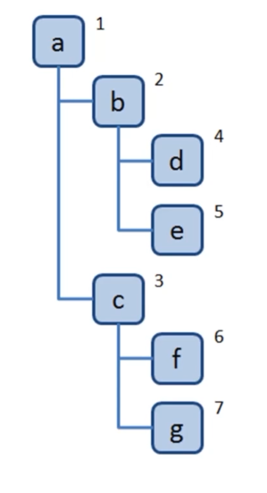
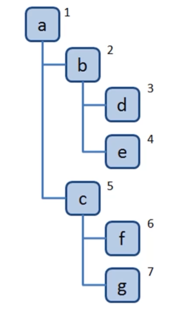

# -
数据结构的差异和用法
# 数据结构的区别

#### 基础算法

| 名称 |类型| 特点 |
| --- | ---|--- |
|栈| 数组|后进先出 |
|队列| 数组| 先进先出 | 
|链表| 多个元素组成的列表|储存不连续通过next连接，对比数组增删非首位元素不需要移动元素只需要更改next的指向|
|集合|一种无序且唯一的 |用于去重，判断某元素是否在集合中，求交集，并集|
|字典| 与集合类似但通过键值对存储| 建立映射关系,键值对的增删改查|
|树| 分层数据的抽象模型 | DOM树、级联选择、树形控件 |
|图| 网络结构抽象模型 |由边连接的节点,邻接矩阵、邻接表|
|堆| 特殊的完全二叉树| 所有的节点都大于等于(最大堆)或小于等于(最小堆)它的子节点|

#### 进阶算法
| 名称 | 1 |
| --- | --- |
|搜索排序| |
|分而治之| |
|动态规划| |
|贪心算法| |
|回溯算法| |
# 数据结构用法

###  栈
> 后进先出 使用js中的` push() `和` pop() `

有效的括号(LeetCode.20)  
扫描字符串，遇到左括号入栈，遇到栈顶括号类型匹配的右括号接出栈，类型不匹配直接判定为不合法。  
最后栈空了就合法，否则不合法。  

### 队列
> 先进先出 使用js中的` push() `和` shift() `

应用场景: 食堂排队打饭、js异步的任务队列  
最近请求次数(LeetCode.933) 

### 链表
```javascript
const a= { val: 'a' };
const b= { val: 'b' };
const c= { val: 'c' };
const d= { val: 'd' };
a.next = b;
b.next = c;
c.next = d;

//遍历链表  
let p = a;
while (p){
  console.log(p.val)
  p = p.next;
}

//插入
const e = { val: 'e' };
c.next = e;
e.next = d;

//删除
c.next = d;
```
### 集合
```javascript
//去重
const arr = [1,1,2,2];
const arr2 = [...new Set(arr)];

//判定元素是否在集合中
const set = new Set(arr);
const has = set.has(3);

//求交集
const set2 = new Set([2,3]);
const set3 = new Set([...set].filter(item => set2.has(item)));
```
### 字典
```javascript
const m = new Map();
//增
m.set('a','aa');
m.set('b','bb');

//删
m.delete('b');//删除一个
m.clear();//删除所有的

//改
m.set('a','aaa');//直接覆盖即可

//查
m.get('a');//'aa'
```  
  
两个数组`nums1和nums2`的交集  
用字典建立一个映射关系，记录nums1里所有值,遍历nums2,找出nums1里也有的值  
遇到字典里的值就选出来并充字典中删除
### 树
深度优先遍历  

  

广度优先遍历  


```javascript
const tree = {
  val: 'a',
  children: [
    {
      val: 'b',
      children: [
        {
          val: 'd',
          children: [],
        },
        {
          val: 'e',
          children: [],
        },      
      ]
    },
    {
      val: 'c',
      children: [
        {
          val: 'f',
          children: [],
        },
        {
          val: 'g',
          children: [],
        },       
      ]
    },   
  ]
}

//深度优先遍历
const dfs = (root) => {
  console.log(root.val);
  root.children.forEach(dfs);
}

//广度优先遍历
const bfs = (root) => {
  const q = [root];
  while (q.length>0){
    const n = q.shift();
    console.log(n.val);
    n.children.forEach(child =>{
      q.push(child);
    })
  }
}
```
