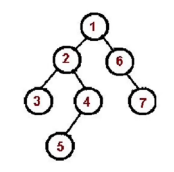
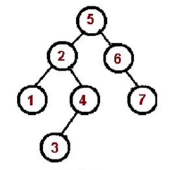
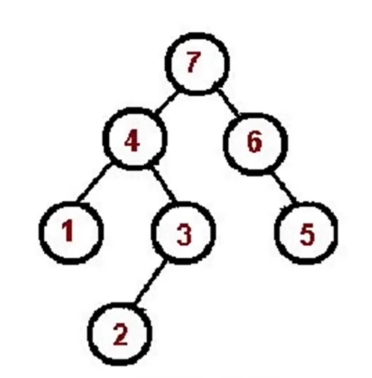
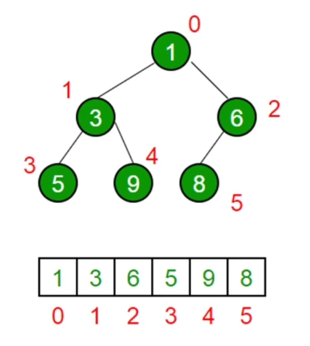

# -
数据结构的差异和用法
# 数据结构的区别

#### 基础算法

| 名称 |类型| 特点 |
| --- | ---|--- |
|栈| 数组|后进先出 |
|队列| 数组| 先进先出 | 
|链表| 多个元素组成的列表|储存不连续通过next连接，对比数组增删非首位元素不需要移动元素只需要更改next的指向|
|集合|一种无序且唯一的 |用于去重，判断某元素是否在集合中，求交集，并集|
|字典| 与集合类似但通过键值对存储| 建立映射关系,键值对的增删改查|
|树| 分层数据的抽象模型 | DOM树、级联选择、树形控件 |
|图| 网络结构抽象模型 |由边连接的节点,邻接矩阵、邻接表|
|堆| 特殊的完全二叉树| 所有的节点都大于等于(最大堆)或小于等于(最小堆)它的子节点|

#### 进阶算法
| 名称 | 特点 |
| --- | --- |
|搜索排序| 将数组按升序或降序排序,搜索是获取数组的下标|
|分而治之| |
|动态规划| |
|贪心算法| |
|回溯算法| |
# 数据结构用法

###  栈
> 后进先出 使用js中的` push() `和` pop() `

有效的括号(LeetCode.20)  
扫描字符串，遇到左括号入栈，遇到栈顶括号类型匹配的右括号接出栈，类型不匹配直接判定为不合法。  
最后栈空了就合法，否则不合法。  

### 队列
> 先进先出 使用js中的` push() `和` shift() `

应用场景: 食堂排队打饭、js异步的任务队列  
最近请求次数(LeetCode.933) 

### 链表
```javascript
const a= { val: 'a' };
const b= { val: 'b' };
const c= { val: 'c' };
const d= { val: 'd' };
a.next = b;
b.next = c;
c.next = d;

//遍历链表  
let p = a;
while (p){
  console.log(p.val)
  p = p.next;
}

//插入
const e = { val: 'e' };
c.next = e;
e.next = d;

//删除
c.next = d;
```
### 集合
```javascript
//去重
const arr = [1,1,2,2];
const arr2 = [...new Set(arr)];

//判定元素是否在集合中
const set = new Set(arr);
const has = set.has(3);

//求交集
const set2 = new Set([2,3]);
const set3 = new Set([...set].filter(item => set2.has(item)));
```
### 字典
```javascript
const m = new Map();
//增
m.set('a','aa');
m.set('b','bb');

//删
m.delete('b');//删除一个
m.clear();//删除所有的

//改
m.set('a','aaa');//直接覆盖即可

//查
m.get('a');//'aa'
```  
  
两个数组`nums1和nums2`的交集  
用字典建立一个映射关系，记录nums1里所有值,遍历nums2,找出nums1里也有的值  
遇到字典里的值就选出来并充字典中删除
### 树
深度优先遍历

广度优先遍历
  

```javascript
const tree = {
  val: 'a',
  children: [
    {
      val: 'b',
      children: [
        {
          val: 'd',
          children: [],
        },
        {
          val: 'e',
          children: [],
        },      
      ]
    },
    {
      val: 'c',
      children: [
        {
          val: 'f',
          children: [],
        },
        {
          val: 'g',
          children: [],
        },       
      ]
    },   
  ]
}

//深度优先遍历
const dfs = (root) => {
  console.log(root.val);
  root.children.forEach(dfs);
}

//广度优先遍历
const bfs = (root) => {
  const q = [root];
  while (q.length>0){
    const n = q.shift();
    console.log(n.val);
    n.children.forEach(child =>{
      q.push(child);
    })
  }
}
//二叉树广度优先遍历
const bfs = (root) => {
    const q = [root];
    while (q.lenght > 0) {
       const n = q.shift()
       consol.log(n.val);
       if(n.left) q.push(n.left);
       if(n.right) q.push(n.right);
    }
};
```
### 二叉树

先序遍历

中序遍历

后序遍历
  
```javascript
const bt = {
  val: 1,
  left: {
    val: 2,
    left: {
      val: 4,
      left: null,
      right: null,
    },
    right: {
      val: 5,
      left: null,
      right: null,
    }
  },
  right: {
    val: 3,
    left: {
      val: 6,
      left: null,
      right: null,
    },
    right: {
      val: 7,
      left: null,
      right: null,
    }
  }
}

//先序遍历
const preorder = (root) => {
  if(!root){return;}
  console.log(root.val);
  preorder(root.left);
  preorder(root.right);
}
//非递归版本(先序遍历)
const preorder1 =(root) =>{
  if(!root){return;}
  const stack = [root];
  while(stack.length){
    const n = stack.pop();
    console.log(n.val)//根节点值
    if(n.right) stack.push(n.right);
    if(n.left) stack.push(n.left);  
  }
}


//中序遍历
const inorder = (root) => {
  if(!root){return;}
  inorder(root.left);
  console.log(root.val);
  inorder(root.right);
}
//非递归版本(中序遍历)
const inorder1 = (root) => {
  if(!root){return;}
  const stack = [];
  let p = root;
  while(stack.length || p){
    while(p){
      stack.push(p);
      p = p.left;
    }
    const n = stack.pop();
    console.log(n.val);
    p = n.right;
  }
}

//后序遍历
const postorder = (root) =>{
  if(!root){return;}
  postorder(root.left);
  postorder(root.right);
  console.log(root.val);
}
//非递归版本(后序遍历)
const postorder1 = (root) =>{
  if(!root){return;}
  const outputStack = [];
  const stack = [root];
  while(stack.length){
    const n = stack.pop();
    outputStack.push(n);
    if(n.left) stack.push(n.left);
    if(n.right) stack.push(n.right);  
  }
  while (outputStack.length){
    const n = outputStack.pop();
    console.log(n.val); 
  }
}
```

### 图
```javascript
const graph={
  0: [1,2],
  1: [2],
  2: [0,3],
  3: [3]
};
//图的深度优先遍历
const visited = new Set();
const dfs = (n) => {
  console.log(n);
  visited.add(n);
  graph[n].forEach(c=>{
    if(!visited.has(c)){
      dfs(c);
    } 
  });
  
}
//图的深度优先遍历
const bfs=(root)=>{
  const visited = new Set();
  visited.add(root);
  const q = [root];
  while (q.length) {
    const n = q.shift();
    console.log(n);
    graph[n].forEach(c => {
      if (!visited.has(c)) {
        q.push(c);
        visited.add(n);
      }
    });
  }
}
```
### 堆
堆是一个完全二叉树(有完整的左右节点，或者只缺少右边的若干节点)，js通常使用数组来表示堆  
  
>  左侧子节点位置是 2 x index + 1  
>  右侧子节点的位置是 2 x index + 2  
>  父节点位置 (index-1)/2  
```javascript
//最小堆类
class MinHeap {
  constructor() {
    this.heap = [];
  }

  swap(i1, i2) {
    let temp = this.heap[i1];
    this.heap[i1] = this.heap[i2];
    this.heap[i2] = temp;
  }

  getParentIndex(index) {//获取父节点
    return ((index - 1) >> 1)
    //Math.floor((index-1)/2)
  }

  getLeftIndex(index) {//获取父节点
    return index * 2 + 1;
    //Math.floor((index-1)/2)
  }

  getRightIndex(index) {//获取父节点
    return index * 2 + 2;
    //Math.floor((index-1)/2)
  }

  shiftUp(index) {
    if (index === 0) return;

    let parentIndex = this.getParentIndex(index);
    if (this.heap[parentIndex] > this.heap[index]) {

      this.swap(parentIndex, index);
      this.shiftUp(parentIndex);
    }
  }

  insert(value) {
    this.heap.push(value);
    this.shiftUp(this.heap.length - 1);

  }

  shiftDown(index) {
    const indexLeft=this.getLeftIndex(index);
    const indexRight=this.getRightIndex(index);
    if(this.heap[indexLeft]<this.heap[index]){
      this.swap(indexLeft,index);
      this.shiftDown(indexLeft);
    }
    if(this.heap[indexRight]<this.heap[index]){
      this.swap(indexRight,index);
      this.shiftDown(indexRight);
    }
  }

  pop() {
    this.heap[0] = this.heap.pop();
    this.shiftDown(0)
  }
  head(){
    return this.heap[0];
  }
  size(){
    return this.heap.length;
  }
}
```
### 排序和搜索
排序使用 `sort` 方法 搜索使用 `indexOf` 方法
#### 排序
```javascript
const arr=[5,4,3,2,1];

//冒泡排序 x
Array.prototype.bubbleSort = function () {
  for (let i = 0; i < this.length - 1; i++) {
    for (let j = 0; j < this.length - 1 - i; j++) {
      if (this[j] > this[j + 1]) {
        const temp = this[j];
        this[j] = this[j + 1];
        this[j + 1] = temp;
      }
    }
  }
}

//选择排序 x
Array.prototype.selectionSort = function () {
  for (let i = 0; i < this.length - 1; i++) {
    let indexMin = i;
    for (let j = i; j < this.length; j++) {
      if (this[j] < this[indexMin]) {
        indexMin = j;
      }
    }
    if(indexMin !== i){
      let temp = this[i];
      this[i] = this[indexMin];
      this[indexMin] = temp;
    }
  }
}

//插入排序 x
Array.prototype.insertionSort = function () {
  for(let i=1;i<this.length;i++){
    const temp = this[i];
    let j = i;
    while (j > 0) {
      if (this[j - 1] > temp) {
        this[j] = this[j - 1];
      } else {
        break;
      }
      j--;
    }
    this[j] = temp;
  }
}

//归并排序
Array.prototype.mergeSort = function () {
  const rec = (arr) => {
    if (arr.length === 1) return arr;
    const mid = Math.floor(arr.length / 2);
    const left = arr.slice(0, mid);
    const right = arr.slice(mid, arr.length);
    const orderLeft = rec(left);
    const orderRight = rec(right);
    const res = [];
    while (orderLeft.length || orderRight.length) {
      if (orderRight.length && orderLeft) {
        res.push(orderLeft[0] < orderRight[0] ? orderLeft.shift() : orderRight.shift())
      } else if (orderLeft.length) {
        res.push(orderLeft.shift())
      } else if (orderRight.length) {
        res.push(orderRight.shift())
      }
    }
    return res;
  }
  const res = rec(this)
  res.forEach((n, i) => this[i] = n)
}

//快速排序
Array.prototype.quickSort = function () {
  const rec = (arr) => {
    if (arr.length === 1) {
      return arr;
    }
    const left = [];
    const right = [];
    const mid = arr[0];
    for (let i = 1; i < this.length; i++) {
      if (arr[i] < mid) {
        left.push(arr[i]);
      } else {
        right.push(arr[i]);
      }
    }
    return [...rec(left), mid, ...rec(right)]

  }
  const res = rec(this);
  res.forEach((n, i) => this[i] = n);
}
```
#### 搜索
```javascript
//顺序搜索
Array.prototype.sequentialSearch=function(item){
  for (let i=0;i<this.length;i++){
    if(this[i]===item){
      return i;
    }
  }
  return -1;
}
//二分搜索 数据必须是有序列表
Array.prototype.binarySearch = function (item) {
  let low = 0;
  let high = this.length - 1;
  while (low <= high) {
    const mid = Math.floor((low + high) / 2);
    const element = this[mid]
    if (element < item) {
      low = mid + 1
    } else if (element > item) {
      high = mid - 1
    }else{
      return mid;
    }
  }
  return -1;
}
```
